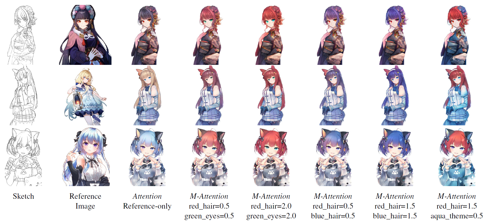

# Introduction
This repository is the official implementation of paper [Two-step Training: Adjustable Sketch Colorization via Reference Image and Text Tag](https://onlinelibrary.wiley.com/doi/full/10.1111/cgf.14791).


An improved version using LDM has been released in [ColorizeDiffusion](https://github.com/tellurion-kanata/colorizeDiffusion).
## Instruction
To run our code, please install all the libraries required in our implementation by running the command:
```
pip install -r requirements.txt
```
### 1.Data preparation
The training dataset can be downloaded from [Danbooru2019 figures](https://www.gwern.net/Crops#danbooru2019-figures), or using the rsync command:
```
rsync --verbose --recursive rsync://176.9.41.242:873/biggan/danbooru2019-figures ./danbooru2019-figures/
```
Generate sketch and reference images with any methods you like, or apply __data/data_augmentation.py__ in this repository and [sketchKeras](https://github.com/lllyasviel/sketchKeras) for reference and sketch images, respectively.
Please organize the training/validation/testing dataset as:  
├─ dataroot   
│  ├─ color  
│  ├─ reference  
│  ├─ sketch  

If you don't want to generate reference images for training (which is a little time-consuming), you can use the `latent shuffle` function in __models/modules.py__ during training by cancelling the comment in the `forward` function  in __draft.py__. Note that this only works when the reference encoder is semantically aware (for example, pre-trained for classification or segmentation), and this will suffer approximately 10%-20% deterioration.
 
### 2.Training 
Before training our colorization model, you need to prepare a pre-trained CNN which is used as the reference encoder in our method. We suggest you adopt a CNN which is pre-trained on both ImageNet and [Danbooru2020](https://www.gwern.net/Danbooru2021#danbooru2020) to achieve best colorization performance. By the way, clip image encoder is found inefficient in our paper, but this deterioration can be solved by combining our models with latent diffusion according to our latest experiments.

Using the following command for 1st training:
```
python train.py --name [project_name] -d [dataset_path] -pre [pretrained_CNN_path] -bs [batch_size] -nt [threads used to read input] -at [add,fc(default)]
```
and the following command for 2nd training:
```
python train.py --name [project_name] -d [dataset_path] -pre [pretrained_CNN_path] -pg [pretrained_first_stage_model] -bs [batch_size] -nt [threads used to read input] -m mapping
```
More information regarding training and testing options can be found in __options/options.py__ or by using --help.

### 3.Testing
To use our pre-trained model for sketch colorization, download our pre-trained networks from [Releases](https://github.com/ydk-tellurion/sketch_colorizer/releases/tag/models) using the following commands:
For colorization model:
```
python test.py --name [project_name] -d [dataset_path] -pre [pretrained_CNN_path] 
```
For controllable model:
```
python test.py --name [project_name] -d [dataset_path] -pre [pretrained_CNN_path] -m mapping
```
We didn't implement user interface for changing the tag values, so you need to change the values of tags manually in the `modify_tags` function in __mapping.py__. Corresponding tag id can be found in __materials__. Besides, you can activate `--resize` to control the output image size as `load_size`. All the generated images are saved in __checkpoints/[model_name]/test/fake__. Details of training/testing options can be found in __options/options.py__.

### 4. Evaluation
We offer an evaluation using FID distance, using the following command for evaluation. Activate `--resize` if you want to change the evaluation image size.
```
python evaluate.py --name [project_name] --dataroot [dataset_path]
```
## Code Reference
1. [vit-pytorch](https://github.com/lucidrains/vit-pytorch)
2. [pytorch-CycleGAN-and-pix2pix](https://github.com/junyanz/pytorch-CycleGAN-and-pix2pix)
3. [pretrained-models.pytorch](https://github.com/Cadene/pretrained-models.pytorch)
4. [pytorch-vision](https://github.com/pytorch/vision)
5. [pytorch-spectral-normalization-gan](https://github.com/christiancosgrove/pytorch-spectral-normalization-gan)
